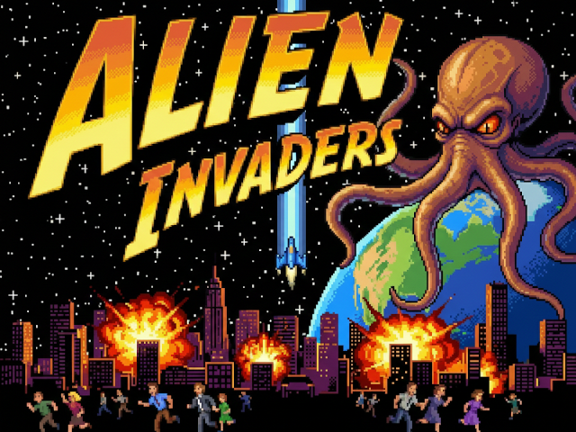
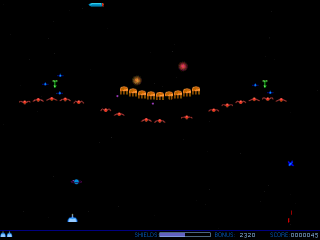

# Alien Invaders

A modernized **Godot 4.x** port of the original 1998–1999 Alien Invaders — a 2D shoot-em-up originally written in Visual Basic 6 with DirectX. The Godot version is the actively developed, current incarnation of the game; the original VB6 source is preserved alongside it for reference and history.

## Play

**[Play in your browser](https://lex3001.github.io/AlienInvaders/)** — no install required.

Controls: Arrow keys / A,D to move, Space to fire, Shift for shields.

The game also runs natively via Godot. To try it locally:

1. Install [Godot 4.3+](https://godotengine.org/download)
2. Open the `godot/` folder as a project (`godot/project.godot`)
3. Press **F5** to run

The web build is produced and published automatically by a GitHub Actions workflow ([`.github/workflows/deploy.yml`](.github/workflows/deploy.yml)) — see [DEPLOY.md](DEPLOY.md) for details.

## What's Here Today

- **Godot 4.x port** (`godot/`) — a complete rewrite of the game in GDScript: core engine, alien AI, levels, scoring, power-ups, UI, sound, and a test suite. See [godot/README.md](godot/README.md) for the project structure and [godot/IMPLEMENTATION_SUMMARY.md](godot/IMPLEMENTATION_SUMMARY.md) for what's been built.
- **Original VB6 source (1999)** (`vb6/`) — the complete original project, assets, and release notes, kept as the authoritative reference for the game's original logic and feel. See [vb6/README.md](vb6/README.md) and the docs under [vb6/docs/](vb6/docs/).

## Repository Layout

- `godot/` — Current Godot 4.x port: scripts, scenes, assets, and tests
- `vb6/` — Original Visual Basic 6 code and assets (1999)
- `vb6/docs/` — In-depth technical documentation for the original game
- `DEPLOY.md` — How the web build is exported and deployed to GitHub Pages
